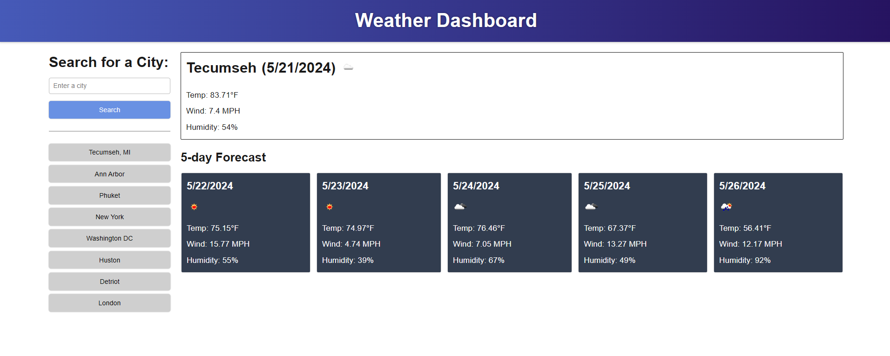

# Weather Dashboard
A five day weather forecast by location

## Description

A dashboard showing the current weather and a 5 day forecast for a searched city. The deployed web application can be found here: https://hannahschwen.github.io/weather-dashboard/

## Usage

To find weather by location, users should search for a city in the search box. The dashboard will display the current temperature, wind, humidity, and an icon of current conditions at the top of the page, and a 5 day forecast will display at the bottom.

A history will be kept of the user's searches. Click on one of the grey buttons that appear under the search box to easily return to recently searched locations. If multiple locations are searched in one session, only the 8 most recent searches will be retained for the next session.

The following screenshot shows the weather dashboard, with 8 previously searched cities on the left:

## Credits

This web application uses an API from OpenWeatherMap for weather data.